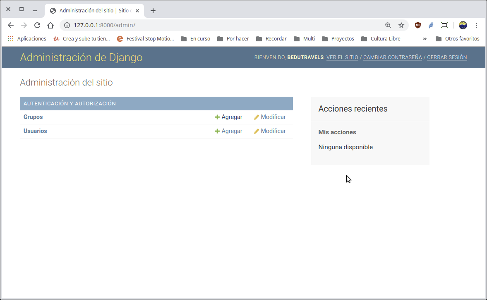
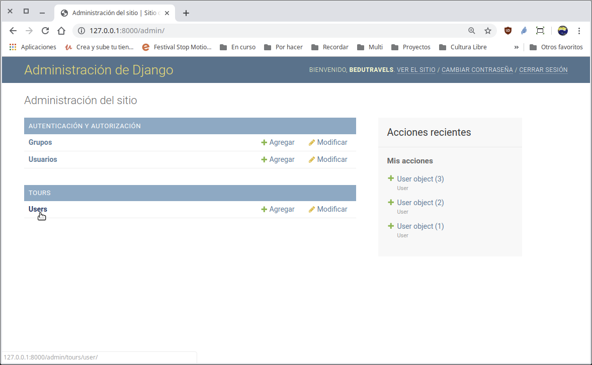
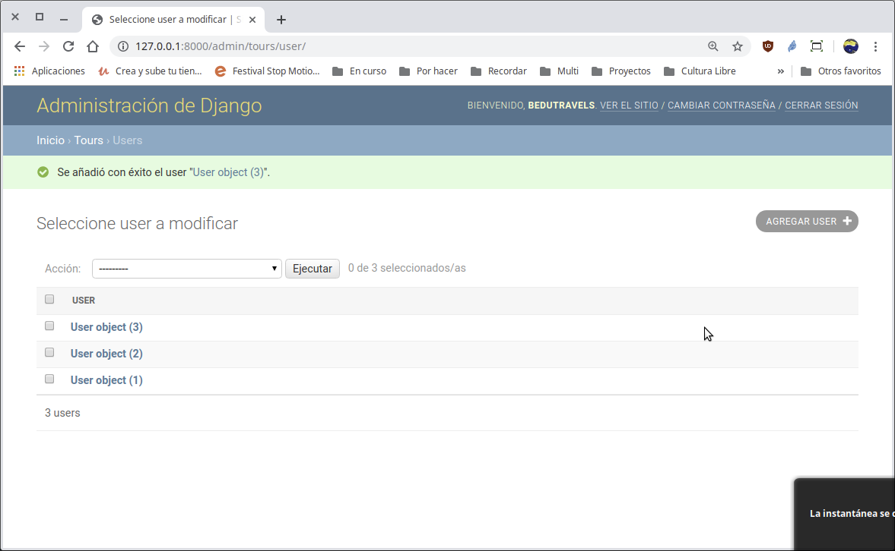

[`Backend con Python`](../../Readme.md) > [`Sesión 04`](../Readme.md) > Ejemplo-01
## Creando una tabla con el modelo de datos de Django

### OBJETIVO
- Conocer y crear el modelo de datos con Django.
- Conocer el sistema de bases de datos usado por Django.
- Configurando Django para manejar datos regionales.
- Agregando el modelo al administrador de Django

#### REQUISITOS
1. Actualizar repositorio
1. Usar la carpeta de trabajo `Sesion-04/Ejemplo-01`
1. Diagrama del modelo entidad-relación para el proyecto __Bedutravels__

   

1. Documentación de Django referente a modelos:
   - Descripción de modelos y ejemplos: https://docs.djangoproject.com/en/2.2/topics/db/models/
   - Referencia a la API de Modelos en Django https://docs.djangoproject.com/en/2.2/ref/models/
   - Referencia a los tipos de datos que maneja Django https://docs.djangoproject.com/en/2.2/ref/models/fields/#field-types

#### DESARROLLO
1. Usando el modelo entidad-relación, crear cada modelo correspondiente a cada tabla.

   __Creando el modelo para la tabla User agregando lo siguiente al archivo `Bedutravels/tours/models.ps`:__

   ```python
   from django.db import models

   # Create your models here.
   class User(models.Model):
       """ Define la tabla User """
       nombre = models.CharField(max_length=40)
       apellidos = models.CharField(max_length=80, null=True, blank=True)
       email = models.EmailField()
       fechaNacimiento = models.DateField(null=True, blank=True)
       GENERO = [
           ("H", "Hombre"),
           ("M", "Mujer"),
       ]
       genero = models.CharField(max_length=1, choices=GENERO)
       clave = models.CharField(max_length=40, null=True, blank=True)
       tipo = models.CharField(max_length=45, null=True, blank=True)
   ```
   Observar como se han remplazado los tipos de datos de SQL por tipos de datos de Django, además, cada campo definido es requerido a menos que se indique lo contrario, que es el caso de los campos con los parámetros `null=True` y `blank=True` que son opcionales.

   También está el caso del campo __genero__ que sólo puede tomar las opciones indicadas por el atributo `choices=GENERO` y que puede ser empleado para cuando las opciones no cambiarán en toda la vida de la aplicación.

   __Nota:__ Django por omisión usa la base de datos SQLite3 y crea un archivo en la carpeta del proyecto con el nombre `db.sqlite3`.

   __Antes de continuar, tenemos que indicar a Django algunas configuraciones locales en el archivo `settings.py`:__

   ```python
   # Internationalization
   # https://docs.djangoproject.com/en/2.2/topics/i18n/

   LANGUAGE_CODE = 'es-MX'
   TIME_ZONE = 'America/Mexico_City'
   ```

   La lista tanto de códigos de lenguaje como de zonas horarias se puede consultar en:
   - http://www.i18nguy.com/unicode/language-identifiers.html
   - https://en.wikipedia.org/wiki/List_of_tz_database_time_zones

   __Avisando a Django que hemos modificado el archivo `models.py`:__

   ```console
   (Bedutravels) Ejemplo-01/Bedutravels $ python manage.py makemigrations
   Migrations for 'tours':
     tours/migrations/0001_initial.py
       - Create model User

   (Bedutravels) Ejemplo-01/Bedutravels $ python manage.py migrate
   Operations to perform:
     Apply all migrations: admin, auth, tours, contenttypes, sessions
   Running migrations:
     Applying contenttypes.0001_initial... OK
     Applying auth.0001_initial... OK
     Applying admin.0001_initial... OK
     Applying admin.0002_logentry_remove_auto_add... OK
     Applying admin.0003_logentry_add_action_flag_choices... OK
     Applying contenttypes.0002_remove_content_type_name... OK
     Applying auth.0002_alter_permission_name_max_length... OK
     Applying auth.0003_alter_user_email_max_length... OK
     Applying auth.0004_alter_user_username_opts... OK
     Applying auth.0005_alter_user_last_login_null... OK
     Applying auth.0006_require_contenttypes_0002... OK
     Applying auth.0007_alter_validators_add_error_messages... OK
     Applying auth.0008_alter_user_username_max_length... OK
     Applying auth.0009_alter_user_last_name_max_length... OK
     Applying auth.0010_alter_group_name_max_length... OK
     Applying auth.0011_update_proxy_permissions... OK
     Applying tours.0001_initial... OK
     Applying sessions.0001_initial... OK

   (Bedutravels) Ejemplo-01/Bedutravels $
   ```

   __Django ya cuenta con un sistema CRUD para nuestros modelos y para activarlo es necesario agregar un usuario administrador cuando menos:__

   ```console
   (Bedutravels) Ejemplo-01/Bedutravels $ python manage.py createsuperuser
   Nombre de usuario (leave blank to use 'rctorr'): bedutravels
   Dirección de correo electrónico: bedutravels@gmail.com
   Password:
   Password (again):
   La contraseña es muy similar a  nombre de usuario.
   Bypass password validation and create user anyway? [y/N]: y
   Superuser created successfully.

   (Bedutravels) Ejemplo-01/Bedutravels $
   ```

   Abrir la url http://localhost:8000/admin y usar los siguientes datos para entrar:
   - User: bedutravels
   - Clave: bedutravels
   - Email: bedutravels@gmail.com

   __Se deberá de ver algo similar a la siguiente imagen:__

   

   Pero nuestro modelo User ¿dónde está?

   __Agregando el siguiente código al archivo `Bedutravels/tours/admin.py`:__

   ```python
   from django.contrib import admin
   from .models import User

   # Register your models here.
   admin.site.register(User)
   ```
   Actuaizamos el navegador se obtendrá lo siguiente:

   

   Ahora ya se puede listar, agregar, actualizar o eliminar registros en la tabla User, así se verías después de agregar tres usuarios a nuestro modelo User.

   

   Diviértete!!!
