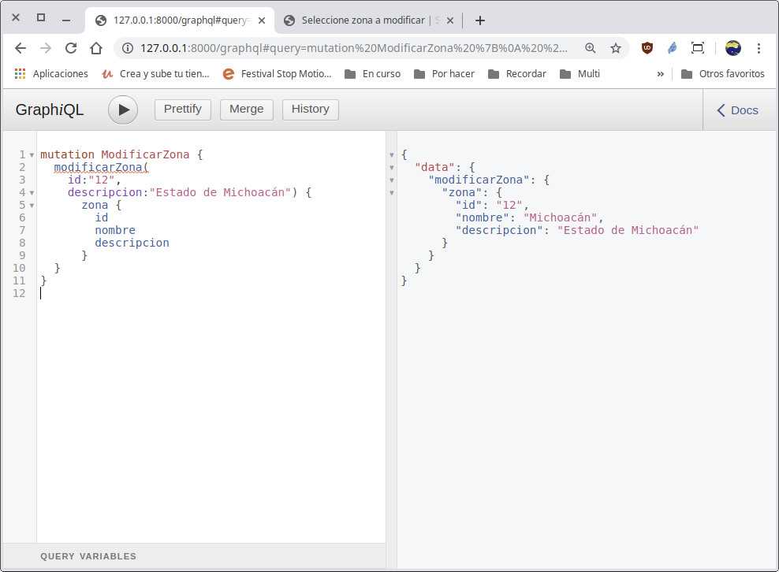
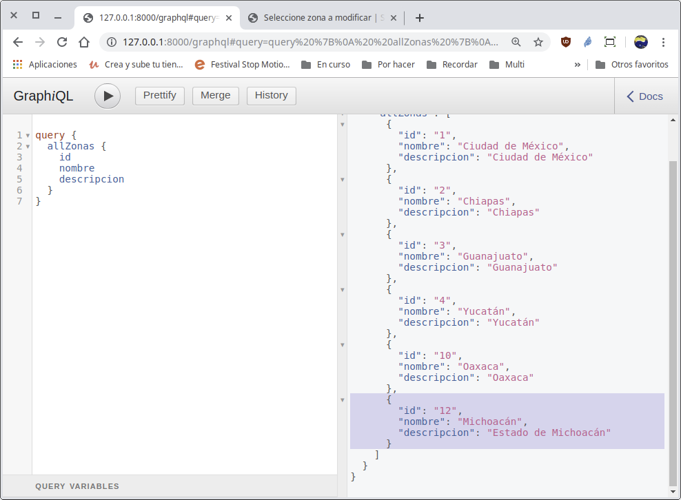

[`Backend con Python`](../../Readme.md) > [`Sesión 07`](../Readme.md) > Reto-03
## Definiendo mutaciones (operaciones) para el API GraphQL

### OBJETIVOS
- Aplicar el concepto de mutaciones de GraphQL
- Crear una mutación para modificar una Zona existente

### REQUISITOS
1. Actualizar repositorio
1. Usar la carpeta de trabajo `Sesion-07/Reto-03`
1. Activar el entorno virtual __Bedutravels__
1. Diagrama de entidad-relación del proyecto Bedutravels
   

### DESARROLLO
1. Crear la mutación __ModificarZona__ en el archivo `Bedutravels/tours/schema.py` que permita modificar un registro a la tabla __Zona__

   Se crea la clase __ModificarZona__ de la siguiente manera:

   ```python
   class ModificarZona(graphene.Mutation):
       """ Permite realizar la operación de modificar en la tabla Zona """
       class Arguments:
           """ Define los argumentos para modificar una Zona """
           ???

       zona = graphene.Field(ZonaType)

       def mutate(self, info, ???):
           """
           Se encarga de modificar la Zona identificada por el id.
           """
           try:
             ???
           except Zona.DoesNotExist:
               # Si la zona no existe, se procesa la excepción
               zona = None
           # Se regresa una instancia de esta mutación
           return ModificarZona(zona=zona)
   ```
   En este caso el único argumento necesario para modificar una Zona es el id, los demás atributos son opciones y son los posibles atributos a modificar.
   ***

1. Agregar la nueva mutación al esquema (schema) en el archivo `Bedutravels/tours/schema.py`

   Por lo tanto hay que modificar la clase __Mutaciones__ de la siguiente manera:

   ```python
   class Mutaciones(graphene.ObjectType):
       crear_zona = CrearZona.Field()
       eliminar_zona = EliminarZona.Field()
       ???
   ```
   ***

1. Modificando una Zona usando la __API__ `/graphql`

   __Creando la zona Michoacán:__

   ```json
   mutation CrearZona {
     crearZona(
       nombre:"Michoacán",
       descripcion:"Michoacán") {
       zona {
         id
         nombre
         descripcion
       }
     }
   }
   ```
   Importante anotar el __id__ porque será usando a continuación

   __Modificando la zona Michoacán:__

   ```json
   mutation ModificarZona {
     modificarZona(
       id:"12",
       descripcion:"Estado de Michoacán") {
         zona {
           id
           nombre
           descripcion
         }
     }
   }
   ```
   el resultado deberá ser similar al siguiente:

   

   
   Observar que la descripción de la Zona Michoacán haya cambiado.
